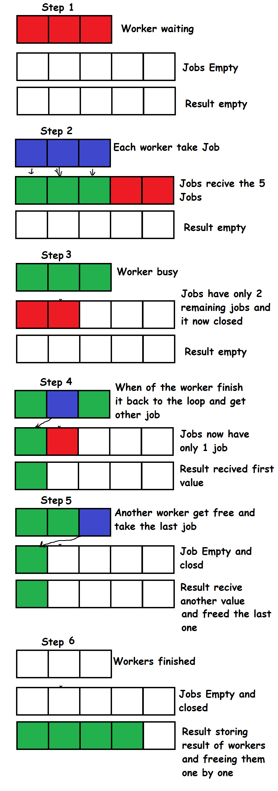

## Objectives

- Command-line arguments and Flags
- Write data to and read data from files
- Concurrency In GO

## Command-Line Arguments and Flags

### Introduction

So far, our programs run the same way every time we execute them. But what if we want to change their behavior from the outside, without recompiling the code? For example, we might want to tell our program _which_ file to open, what URL to connect to, or how many times to run a loop.  
This is where command-line arguments come in. They are values we pass to our program right when we launch it from the terminal, allowing us to configure its behavior at runtime.
### Basic Arguments with `os.Args`
The simplest way to get arguments is by using the `os` package. When your program runs, Go automatically populates a slice of strings called `os.Args` with all the arguments provided.
- `os.Args[0]` is always the path to the program itself.
- `os.Args[1]` is the first argument, `os.Args[2]` is the second, and so on.
```go
package main

import (
	"fmt"
	"os"
)

func main() {
	// os.Args is a slice of strings
	fmt.Println("Program name:", os.Args[0])

	// Check if any other arguments were provided
	if len(os.Args) > 1 {
		fmt.Println("First argument:", os.Args[1])
		fmt.Println("All arguments:", os.Args[1:])
	} else {
		fmt.Println("No arguments provided.")
	}
}
```
Here we using ``os.Args`` to access to command line arguments, the first value is always the file name then after it we find the arguments that we included in our terminal.  
If we save this as `main.go` and run it:
```bash
# Run with no arguments
$ go run main.go
Program name: /var/folders/..../main
No arguments provided.

# Run with arguments
$ go run main.go hello world 123
Program name: /var/folders/..../main
First argument: hello
All arguments: [hello world 123]
```

### Better Arguments with the `flag` Package
While `os.Args` is simple, it's not very robust. What if we want named options (like `-name="John"`)? What if we want default values or help messages?   
For this, Go provides the built-in **`flag`** package. It's the standard way to handle command-line options.  
The basic pattern is:
1. **Define** your flags (e.g., `flag.String()`, `flag.Int()`, `flag.Bool()`). This tells the package what to look for.
2. **Parse** the arguments by calling `flag.Parse()`. This loads the values from the command line into your flag variables.
```go
package main

import (
	"flag"
	"fmt"
)

func main() {
	// 1. Define the flags
	// flag.String(name, default_value, help_message)
	wordPtr := flag.String("word", "default", "The word to say")
	countPtr := flag.Int("n", 1, "Number of times to say it")
	
	// 2. Parse the command line
	flag.Parse()

	// The flags return pointers, so we must dereference them with *
	fmt.Println("Word:", *wordPtr)
	fmt.Println("Count:", *countPtr)

	for i := 0; i < *countPtr; i++ {
		fmt.Println(*wordPtr)
	}
}
```
We started by defining flags:    
- `flag.String("word", "default", "The word to print")`  
	This creates a string flag `-word`. If the user does not provide it, the value defaults to `"default"`. The last argument is the help message shown when running `go run main.go -help`.
- `flag.Int("n", 1, "Number of times to print the word")`  
	This creates an integer flag `-n`. If the user does not provide it, the default is `1`.
	
After that we Parse the flags:
- `flag.Parse()` reads the command-line arguments and stores them in the pointers.
        
Now we have the flags we can their values on our code: 
- Since flags return pointers, you access their values with `*wordPtr` and `*countPtr`.

Now, we can run this program in much more flexible ways:
```shell
# Run with default values
$ go run main.go
Word: default
Count: 1
default

# Run with custom values
$ go run main.go -word=hello -n=3
Word: hello
Count: 3
hello
hello
hello
```
We can get information about how the program works by running it with the `-help` flag. This command displays all the flags that the program accepts, along with the description messages that we provided when defining each flag.
```Shell
# The flag package also provides a -help message for free
$ go run main.go -help
Usage of /var/folders/..../main:
  -n int
    	Number of times to say it (default 1)
  -word string
    	The word to say (default "default")
```

## File Handling
### Introduction
We worked with many programs on our course but all this time we where storing all the data and the result as variables and this store them in memory. When the program finishes or restarts, we lose all the data we worked with. This is fine for simple calculations, but what if we want our program to save its results? Or what if we need to read a large amount of data from an external source?   
To make our data persistent (meaning it lasts after the program stops), we need to work with files. Go provides powerful and simple tools for file I/O (Input/Output) in its standard library, primarily in the `os` and `io` packages.
### Writing to Files
To write to a file in Go, we use `os.Create("hello.txt")`. This command creates a new file if it doesn't exist. If the file already exists, Go clears its contents before opening it. So `os.Create` always gives us a fresh file to write to.

When we call `os.Create`, Go returns two things: a `*os.File` value and an `error`. The `*os.File` is like a handle to the file, allowing us to read from or write to it. The `error` tells us if anything went wrong. If the error is `nil`, everything worked fine. If not, the file wasn’t created successfully.

After opening a file, we must always close it using `file.Close()`. Closing the file makes sure everything we wrote is saved and frees system resources. Forgetting to close files can lead to bugs and data loss, especially in larger programs.

Go provides a helpful tool called `defer` to ensure cleanup happens. When we write `defer file.Close()`, we tell Go to run `file.Close()` at the end of the function. This means we don’t need to remember to close the file in multiple places Go does it for us automatically.

`defer` works even if the function returns early or if something unexpected happens, like a panic. This makes our programs safer and easier to maintain. If we use multiple `defer` statements, Go runs them in reverse order, like a stack.
```go
package main

import (
	"fmt"
	"os"
)

func main() {
	file, err := os.Create("hello.txt")
	if err != nil {
		fmt.Println("Error creating file:", err)
		return 
	}
	defer file.Close()

	data := "Hello, persistent data!"
	_, err = file.WriteString(data)
	if err != nil {
		fmt.Println("Error writing to file:", err)
		return
	}

	fmt.Println("File 'hello.txt' created and written successfully.")
}
```
To write text into the file, we use `file.WriteString(data)`. This function takes a string and writes it directly into the open file. If the file was created or opened earlier with `os.Create` or `os.OpenFile`, calling `file.WriteString("Hello")` will store the text `"Hello"` inside it. The function also returns how many bytes were written and an `error` value. If the error is `nil`, the write was successful; otherwise, something went wrong during the write operation.
### Appending to File
Writing to file helped us to store data. But there’s one small problem: every time we open the file with `os.Create`, we overwrite its contents. That means if we run our program again, the old data disappears and only the new data remains. Sometimes this is what we want, but many times we want to add new data to the end of the file instead of replacing everything. This is called appending.

To append to a file in Go, we don’t use `os.Create`. Instead, we use `os.OpenFile` with special flags. The key one here is `os.O_APPEND`, which tells Go to add data to the end of the file. We also include `os.O_WRONLY` to open the file for writing, and `os.O_CREATE` to make sure the file is created if it doesn't already exist.

Here’s an example of opening a file for appending and writing to it:
```go
package main

import (
	"fmt"
	"os"
)

func main() {
	file, err := os.OpenFile("hello.txt", os.O_APPEND|os.O_WRONLY|os.O_CREATE, 0644)
	if err != nil {
		fmt.Println("Error opening file:", err)
		return
	}
	defer file.Close()

	data := "New line of data!\n"
	_, err = file.WriteString(data)
	if err != nil {
		fmt.Println("Error writing to file:", err)
		return
	}

	fmt.Println("Data appended successfully.")
}
```
In this code:
- `os.O_APPEND` makes sure new data is added to the end of the file.
- `os.O_WRONLY` opens the file for writing.
- `os.O_CREATE` creates the file if it doesn't already exist.
- `0644` sets the file's permissions (standard read/write settings).

Now, each time we run the program, it adds a new line instead of replacing everything. This is perfect for logging, saving history, or building files step by step.

### Reading from Files
To read a file, we use `os.Open()`. This also returns a `*os.File` and an `error`. Just like with writing, we should `defer file.Close()` immediately after opening.

While you _can_ read a file byte by byte, this is often complicated. A much more common and easier way to read a text file is one line at a time. For this, Go provides a powerful tool called the `bufio.Scanner`. We create a new scanner and point it at our open file.
```go
package main

import (
	"bufio"
	"fmt"
	"os"
)

func main() {
	file, err := os.Open("hello.txt")
	if err != nil {
		fmt.Println("Error opening file:", err)
		return
	}
	defer file.Close()

	scanner := bufio.NewScanner(file)

	fmt.Println("Contents of 'hello.txt':")

	for scanner.Scan() {
		fmt.Println(scanner.Text())
	}

	if err := scanner.Err(); err != nil {
		fmt.Println("Error reading file:", err)
	}
}
```
In this code:
- `scanner := bufio.NewScanner(file)` creates a new scanner that "wraps" our open file.
- `for scanner.Scan()` is a loop. `scanner.Scan()` moves to the next line and returns `true` if it found one. When it reaches the end of the file, it returns `false`, and the loop stops.
- `scanner.Text()` returns the line that was just read as a string.
- `scanner.Err()` is an important final check to see if any errors (other than the end of the file) happened while reading.
###  `os.ReadFile` and `os.WriteFile`
Sometimes we don't need to read a file line by line we just want the entire content at once. Or we want to quickly save a whole block of data. For these simple cases, Go gives us two very convenient functions:
- `os.ReadFile()` reads the entire file in one call
- `os.WriteFile()` writes all data to a file in one call

These functions automatically handle opening and closing the file internally, which makes your code shorter and easier to read.
```go
package main

import (
	"fmt"
	"os"
)

func main() {

	data := []byte("This is a simple way to write.")
	err := os.WriteFile("simple.txt", data, 0644)
	if err != nil {
		fmt.Println("Error writing file:", err)
		return
	}
	fmt.Println("Wrote to simple.txt")

	readData, err := os.ReadFile("simple.txt")
	if err != nil {
		fmt.Println("Error reading file:", err)
		return
	}

	fmt.Println("Read from simple.txt:", string(readData))
}
```
In this code:
- `data := []byte(...)` creates a "slice of bytes." These functions work with `[]byte` data, not plain strings.
- `os.WriteFile("simple.txt", data, 0644)` takes the filename, the byte slice, and the file permissions. It creates or overwrites the file in one simple step.
- `readData, err := os.ReadFile("simple.txt")` takes just the filename and returns the _entire_ file's contents as a new byte slice (`readData`).
- `string(readData)` is the standard Go way to convert the `[]byte` slice back into a readable string for printing.
## Concurrency
### Introduction
Modern computers have multiple CPUs (or cores), which let them perform many tasks at the same time. Most programs we’ve written so far, however, run sequentially one step at a time, from top to bottom. If a single task takes a long time (like downloading a file or performing a complex calculation), the entire program has to wait.

Concurrency allows a program to run multiple tasks at the same time, independently of each other. Many languages achieve this with threads, which are separate paths of execution. Creating and managing threads can be slow and resource-intensive. Go, however, makes concurrency simple and efficient with goroutines and channels, allowing us to run many tasks concurrently without the overhead of traditional threads.
### Goroutines
A goroutine is a lightweight, independent path of execution in Go. It allows a function to run at the same time as other functions, enabling true concurrency. Unlike traditional threads, goroutines are extremely cheap to create we can run thousands or even millions without heavy memory use.

To start a goroutine, simply put the `go` keyword before a function call. Go will run that function concurrently in the background while the rest of your program continues.
```go
package main

import (
	"fmt"
	"time"
)

func say(s string) {
	for i := 0; i < 3; i++ {
		fmt.Println(s)
		time.Sleep(100 * time.Millisecond)
	}
}

func main() {
	// Start a goroutine
	go say("world")
	
	// Run this in the main "thread"
	say("hello")
}
```
**Output:**
```
hello
world
hello
world
hello
world
```
Notice how "hello" and "world" are interleaved? The `main` function and the `say("world")` goroutine are running at the same time!
### Using `sync.WaitGroup`
When you launch a goroutine, the `main` function (which runs in its own goroutine) doesn't automatically wait for it to finish.
```go
func main() {
	go say("I am a goroutine")
	
	fmt.Println("Main function is done.")
}
```
In this code, the program will likely exit immediately. The "I am a goroutine" message may never print because the `main` goroutine finishes and terminates the program before the new goroutine gets a chance to run. To fix this, we need a way to make main wait for other goroutines to complete.

A `sync.WaitGroup` is a simple and idiomatic way to wait for a collection of goroutines to finish.
It's essentially a concurrent counter. We use it to tell `main` how many "jobs" it needs to wait for.

It has three methods:
- **`Add(n)`:** Increments the counter by `n`. We call this before starting the goroutine(s) to signal that `n` tasks are about to begin.
- **`Done()`:** Decrements the counter by one. This is called from within the goroutine to signal that it has finished its work.
- **`Wait()`:** Blocks the current goroutine (e.g., `main`) and waits until the counter becomes zero.

```go
package main

import (
	"fmt"
	"sync"
	"time"
)

func worker(id int, wg *sync.WaitGroup) {
	defer wg.Done()
	fmt.Printf("Worker %d starting\n", id)
	time.Sleep(time.Second)
	fmt.Printf("Worker %d done\n", id)
}

func main() {
	var wg sync.WaitGroup

	for i := 1; i <= 3; i++ {
		wg.Add(1)
		go worker(i, &wg)
	}
	fmt.Println("Main: Waiting for workers...")
	wg.Wait()
	fmt.Println("Main: All workers done.")
}
```
Here, we used a **`sync.WaitGroup`** (named `wg`) to coordinate our goroutines.   
In the `main` function, before we start each `worker` goroutine, we call **`wg.Add(1)`** to tell the `WaitGroup` "one more task is starting."   
After launching all the goroutines, `main` calls **`wg.Wait()`**, which simply pauses `main` and waits until the counter goes back down to zero.   
Inside each `worker` function, the **`defer wg.Done()`** line is crucial; it ensures that the counter is decreased by one right before the function finishes.   

This pattern guarantees that the `main` function will only continue and print "All workers done." after all three `worker` goroutines have completed.

### Channels
We've seen how to start concurrent tasks with goroutines and wait for them with `sync.WaitGroup`. But this raises a new question: How do goroutines talk to each other? How does a worker goroutine send its result back to the `main` goroutine?

The Go way is to use channels. A channel is a typed "pipe" that we can send values into and receive values from, ensuring that communication is safe and free of race conditions. This leads to the famous Go motto:
```
"Don't communicate by sharing memory; share memory by communicating."
```
Instead of multiple goroutines trying to access the same variable, we simply pass the data from one to another using a channel.
- **Create a channel:** `ch := make(chan int)` This creates a channel that transports `int`s
- **Send a value:** `ch <- 10` Sends the value `10` into the channel
- **Receive a value:** `value := <-ch` Waits for a value to come out of the channel and assigns it to `value`
#### Unbuffered Channels 
By default, channels are unbuffered. This means they have no capacity to hold any values. This lack of a buffer is a powerful feature, as it makes them tools for synchronization.    
Sending and receiving on an unbuffered channel are blocking operations:
- If we send to a channel (`ch <- 10`), our goroutine blocks until another goroutine is ready to receive from it (`<-ch`).
- If we receive from a channel (`value := <-ch`), our goroutine blocks until another goroutine **sends** to it (`ch <- 10`).

This blocking behavior is how goroutines coordinate.   
#### Example 1: 
Simple Synchronization Here, `main` (a goroutine) and `worker` (another goroutine) use a channel to synchronize.
```go
package main

import (
    "fmt"
    "time"
)

func worker(ch chan string) {
    fmt.Println("Worker: starting work...")
    time.Sleep(1 * time.Second)
    
    // This line blocks until 'main' is ready to receive
    ch <- "Work done!" 
    fmt.Println("Worker: sent message.")
}

func main() {
    ch := make(chan string) // Unbuffered channel

    go worker(ch)

    fmt.Println("Main: waiting for message...")
    // This line blocks until 'worker' sends a message
    msg := <-ch 
    
    fmt.Println("Main: received message:", msg)
}
```
**Output:**
```
Main: waiting for message...
Worker: starting work...
(1 second pause)
Worker: sent message.
Main: received message: Work done!
```
Notice how `main` waited for the `worker` to finish its task. The channel acted as both a communication pipe and a synchronization mechanism, removing the need for a `WaitGroup`.
#### Example 2:
Collecting Results This pattern is extremely useful for collecting results from multiple concurrent tasks.
```go
package main

import (
	"fmt"
	"time"
)

func calculateSum(s []int, c chan int) {
	sum := 0
	for _, v := range s {
		sum += v
		time.Sleep(50 * time.Millisecond) 
	}
	c <- sum
}

func main() {
	nums := []int{1, 2, 3, 4, 5, 6}
	ch := make(chan int)

	// Start two goroutines to calculate parts of the sum
	go calculateSum(nums[:3], ch) // Sum of [1, 2, 3]
	go calculateSum(nums[3:], ch) // Sum of [4, 5, 6]

	fmt.Println("Waiting for results...")

	sum1 := <-ch	
	sum2 := <-ch

	fmt.Println("Sum 1:", sum1)
	fmt.Println("Sum 2:", sum2)
	fmt.Println("Total Sum:", sum1+sum2)
}
```
This example we display how Go uses goroutines and channels to collect results from concurrent tasks. The `calculateSum` function takes a slice of integers, computes their sum, and sends the result through a channel after a short delay.  
In `main`, the list of numbers is split into two halves, and two goroutines run `calculateSum` simultaneously. Both send their results to the same channel once finished.

The main function waits for the results using `sum1 := <-ch` and `sum2 := <-ch`. Each receive operation blocks until a goroutine sends a value, ensuring that the program waits for both tasks to complete before continuing.

Finally, the partial sums are printed along with their total. The order of results may vary since goroutines run concurrently. This pattern is ideal for collecting results from multiple concurrent operations safely.
#### Buffered Channels
Sometimes, we don't want the sender to block immediately. We might want to allow a few values to "queue up." This is a buffered channel, which we create by adding a capacity:
```go
ch := make(chan int, 3) // Creates a buffered channel that can hold 3 ints
```
With a buffered channel, the rules are slightly different:
- Sends only block if the buffer is full.
- Receives only block if the buffer is empty.

This decouples the sender and receiver. A sender can "drop off" a message and continue working, as long as there's space in the buffer.
```go
ch := make(chan int, 3) // Holds up to 3 values

ch <- 1 // Does NOT block
ch <- 2 // Does NOT block
ch <- 3 // Does NOT block
// ch <- 4 // This line WOULD block, because the buffer is full

fmt.Println(<-ch) // Receives 1
// Now there is space, so a send of '4' would no longer block.
```
Here, `ch := make(chan int, 3)` creates a channel that can store up to three integers. Sending the first three values (`1`, `2`, and `3`) doesn’t block because the buffer isn’t full yet. However, trying to send a fourth value would block until at least one value is received. When `fmt.Println(<-ch)` removes the first value, space is freed in the buffer, allowing new sends to proceed.
#### Ranging and Closing Channels
What if we don't know how many results we are going to receive? We can use a `for...range` loop to read from a channel until it's closed.
- `close(ch)`: This signals that no more values will ever be sent on this channel.
- `for item := range ch`: This loop will receive values from the channel until it is closed.

**Important Rules:**
1. Only the sender should ever call `close`. Never the receiver.
2. Sending on a closed channel will cause a panic.
3. Receiving from a closed channel is safe. It will immediately return the zero value for the channel's type (e.g., `0` for `int`, `""` for `string`, `nil` for pointers).

```go
package main

import (
	"fmt"
	"time"
)

func sendNumbers(ch chan int) {
	for i := 1; i <= 5; i++ {
		ch <- i
		time.Sleep(200 * time.Millisecond)
	}
	close(ch)
}

func main() {
	ch := make(chan int)

	go sendNumbers(ch)

	for num := range ch {
		fmt.Println("Received:", num)
	}

	fmt.Println("All numbers received, channel closed.")
}
```
The `sendNumbers` function sends numbers 1 to 5 to the channel, then calls `close(ch)` to indicate no more data will be sent. In `main`, the `for num := range ch` loop automatically receives each value until the channel is closed, then exits gracefully. This pattern is useful when the number of messages to be received isn’t known in advance.
#### Pattern: The Worker Pool
Lets imagine we have 1,000 tasks, like resizing 1,000 images. Doing them one by one (sequentially) is slow. If each takes one second, we will wait over 16 minutes.

A naive fix is to launch 1,000 goroutines (`go doTask(task)`). This is dangerous, as it can easily overwhelm our system's resources (memory, network sockets) and crash our program.

The Worker Pool pattern is the solution. It lets us process all 1,000 tasks concurrently but with a fixed, safe number of goroutines (called "workers"). It gives us control over the level of concurrency.

This pattern is ideal for batch-processing jobs where we have many independent tasks:
- Image or video processing
- Web scraping or crawling
- CPU-intensive data processing
- Handling high-traffic network requests
    
The pattern has three main parts:
1. **The `jobs` Channel:** This is a buffered channel that acts as the task queue. Our `main` goroutine "sends" all the tasks here. It's buffered so `main` can add all the jobs without waiting for a worker to be free.
2. **The `worker` Goroutines:** This is a fixed number of goroutines (e.g., 3 or 8) that we start. All of them read from the same `jobs` channel. They use a `for job := range jobs` loop to "pull" tasks as soon as they are free.
3. **The `results` Channel:** This is another buffered channel. After a worker finishes a job, it sends the result here. It's buffered so the worker can drop off its result and immediately go back to get a new job, without waiting for `main` to read the result.
    

When passing channels to the `worker` function, we use directional types: `func worker(id int, jobs <-chan int, results chan<- int)`
- `jobs <-chan int`: **Receive-only**. This tells Go the `worker` can _only_ read from `jobs`.
- `results chan<- int`: **Send-only**. This tells Go the `worker` can _only_ send to `results`.

This is a compile-time safety feature that prevents bugs, like a worker accidentally adding a new job.

```go

package main

import (
    "fmt"
    "time"
)

func worker(id int, jobs <-chan int, results chan<- int) {
    for job := range jobs {
        fmt.Printf("Worker %d starting job %d\n", id, job)
        time.Sleep(time.Second) // Simulate work
        fmt.Printf("Worker %d finished job %d\n", id, job)
        results <- job * 2
    }
}

func main() {
    const numJobs = 5
    jobs := make(chan int, numJobs)
    results := make(chan int, numJobs)

    for w := 1; w <= 3; w++ {
        go worker(w, jobs, results)
    }


    for j := 1; j <= numJobs; j++ {
        jobs <- j
    }

    close(jobs)

    for r := 1; r <= numJobs; r++ {
        fmt.Println("Result:", <-results)
    }
}
```
Here in our example, the `main` function first sets up the environment by creating two buffered channels: `jobs` and `results`. It then "hires" its workers by launching three `worker` goroutines. These goroutines immediately try to read from the `jobs` channel using a `for job := range jobs` loop, but since the channel is empty, they all block, waiting for work to be assigned.

Next, `main` "assigns" the work, looping five times to send jobs 1 through 5 into the `jobs` channel. As the first three jobs are sent, the three waiting workers instantly unblock, each grabbing one job and starting its 1-second simulated task. `main` continues, quickly sending jobs 4 and 5, which simply sit in the `jobs` channel's buffer because all workers are currently busy.

After sending all five jobs, `main` "closes the factory" by calling `close(jobs)`. This is a crucial signal, informing the workers' `for range` loops that no more jobs will ever be sent, and they should terminate once the buffer is empty.

`main` then moves on to "collect results," entering a final loop set to run five times. Inside this loop, it immediately blocks at `<-results`, waiting for a result to arrive. After about a second, a worker finishes its first job, sends the result to the `results` channel, and then loops back. It discovers job 4 waiting in the `jobs` buffer, takes it, and begins working again. As soon as that result is sent, `main` unblocks, receives and prints the result, and then loops back to block again, waiting for the next one. This "collect-and-wait" process repeats.

This leads to the "graceful shutdown." When a worker finishes its final job, it loops back and checks the `jobs` channel. It finds the channel is now **both empty and closed**, which causes its `for range` loop to terminate, allowing the goroutine to exit. Once `main` has collected all 5 results, its loop finishes, and the program exits cleanly, all workers having shut down.




#### The `select` Statement
One final, powerful tool is the `select` statement.The `select` statement allows a single goroutine to wait on multiple channel operations at the same time. This means our program can react to whichever channel becomes ready first whether that’s receiving a message, sending a value, or even handling a timeout.

When a `select` runs, it blocks until one of its cases can proceed. Once that happens, the corresponding case is executed. If multiple channels are ready at once, Go chooses one randomly. This helps us build programs that can manage several concurrent events efficiently without manually checking each channel.

Here’s a basic example:
```go
package main

import "fmt"

func main() {
	ch1 := make(chan string)
	ch2 := make(chan string)
	ch3 := make(chan string)

	go func() { ch1 <- "Hello from ch1" }()
	go func() { ch2 <- "Hello from ch2" }()

	select {
	case msg1 := <-ch1:
		fmt.Println("Received message from ch1:", msg1)
	case msg2 := <-ch2:
		fmt.Println("Received message from ch2:", msg2)
	case ch3 <- "some value":
		fmt.Println("Sent 'some value' to ch3")
	}
}
```
In this program, `select` waits for any of the three cases to be ready. Whichever channel operation is ready first will execute its block. This allows the goroutine to handle whichever communication happens first a common need in concurrent applications.

This is extremely useful for:

**Timeouts** A very common use of `select` is setting a **timeout** for a task. For example, you may want to wait for a result but not forever. The `time.After` function helps with this it returns a channel that automatically sends a value after a specific duration.
```go
package main

import (
	"fmt"
	"time"
)

func main() {
	taskCh := make(chan string)

	go func() {
		time.Sleep(3 * time.Second) // Simulate a long-running task
		taskCh <- "Task complete!"
	}()

	select {
	case res := <-taskCh:
		fmt.Println("Received result:", res)
	case <-time.After(2 * time.Second):
		fmt.Println("Operation timed out!")
	}
}
```
In this example, the task takes 3 seconds to finish, but the timeout is set for 2 seconds. Since the task doesn’t finish in time, the `time.After` channel sends a signal first, and the program prints **"Operation timed out!"**. This is a simple and effective way to make sure our program doesn’t hang indefinitely.

**Non-Blocking Operations;** `select` can also be used to make non-blocking channel operations. By adding a `default` case, we ensure that the `select` statement never blocks if no channel is ready, the `default` case runs immediately.
```go
package main

import "fmt"

func main() {
	ch := make(chan string, 1)

	select {
	case ch <- "message":
		fmt.Println("Sent message")
	default:
		fmt.Println("No message sent (channel was full or nil)")
	}

	select {
	case msg := <-ch:
		fmt.Println("Received:", msg)
	default:
		fmt.Println("No message received (channel was empty or nil)")
	}
}
```
ere, the first `select` tries to send `"message"` to the channel. If the channel isn’t full, the send happens immediately. If it’s already full, the `default` case executes, and the program continues without waiting. The second `select` works the same way for receiving data if the channel is empty, it moves on instantly.
